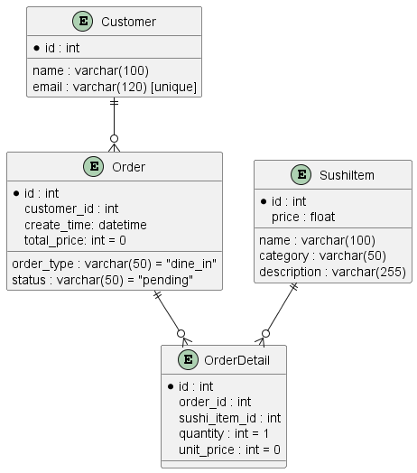
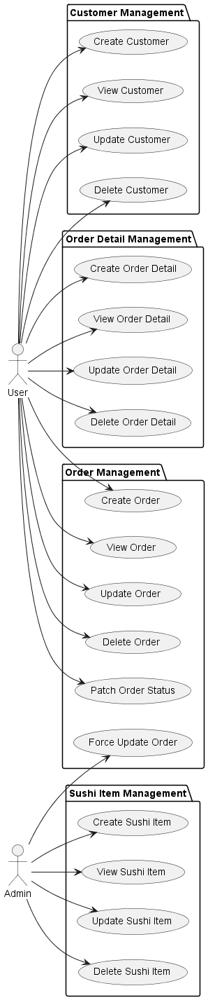
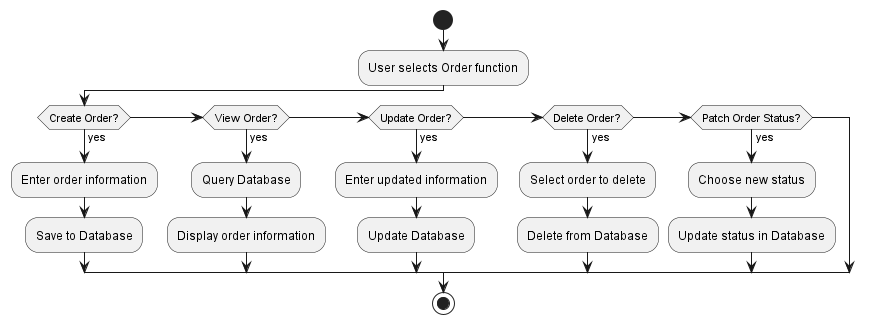
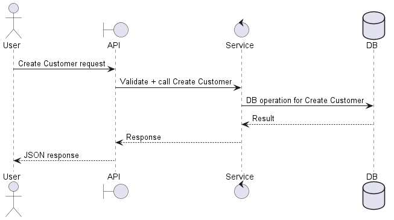
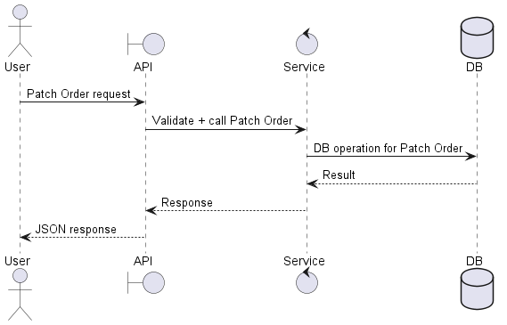

# Sushi Restaurant Management API

A backend application for managing a sushi restaurant, built with **Flask**, **SQLAlchemy**, **Flasgger (Swagger UI)**, and **Docker**.  
It supports CRUD operations for Customers, Sushi Items, Orders, and Order Details.

---

## Table of Contents
1. [Introduction](#1-introduction)  
2. [Technologies](#2-technologies)  
3. [System Diagrams](#3-system-diagrams)  
4. [Project Structure](#4-project-structure)  
5. [Installation & Running](#5-installation--running)  
6. [API Documentation & Swagger UI](#6-api-documentation--swagger-ui)  
7. [Unit Testing](#7-unit-testing)  
8. [Learning Objectives](#8-learning-objectives)  
9. [Future Improvements](#9-future-improvements)  
10. [About the Author](#10-about-the-author)  
11. [License](#11-license)

---

## 1. Introduction  

This project is a **Sushi Restaurant Management System** that provides REST APIs for:  
- Managing Customers  
- Managing Sushi Items  
- Managing Orders  
- Managing Order Details  

The project follows a **layered/clean architecture**:  
- `domain` → core entities & domain rules  
- `application` → business logic / services  
- `infrastructure` → persistence (database models, repositories)  
- `presentation` → REST API routes  

It uses **Flask**, **SQLAlchemy**, and optionally **Docker**. API documentation is provided with **Swagger UI (Flasgger)**.

For details, see [docs/architecture.md](docs/architecture.md).

---

## 2. Technologies  

- Python (>=3.9)  
- Flask, Flask-Migrate, SQLAlchemy  
- SQL Server (via pyodbc) or SQLite  
- Docker (optional)  
- Swagger UI (Flasgger)  

---

## 3. System Diagrams

### 3.1. Entity Relationship Diagram (ERD)



### 3.2. Use Case Diagram



### 3.3. Activity Diagrams

- Manage Sushi Item

    

- Manage Order workflow

    

### 3.4. Sequence Diagrams

- Customer create an account

    

- Employee change order status

    

For full diagrams, see [docs/diagrams.md](docs/diagrams.md)

---

## 4. Project Structure  

The repository is organized to clearly separate **core infrastructure**, **domain modules**, and **documentation**, making it easier to maintain, test, and extend.
```markdown
sushi-restaurant-management/
│
├── app/ # Main application source
│ ├── core/ # Global config, DB extensions, error handler, logging
│ ├── modules/ # Domain-driven modules
│ │ ├── customer/
│ │ │ ├── domain/ # Domain entities & rules
│ │ │ ├── application/ # Business logic / services
│ │ │ ├── infrastructure/ # Models, repository
│ │ │ └── presentation/ # API routes (Flask Blueprints)
│ │ ├── order/
│ │ ├── order_detail/
│ │ └── sushi_item/
│ │
│ ├── static/ # Static files (including swagger.json for Swagger UI)
│ ├── app_factory.py # Application factory (create_app)
│ └── init.py
│
├── docs/ # Documentation
│ ├── architecture.md # Overview of architecture & design decisions
│ ├── api.md # API documentation (overview, usage, endpoints)
│ ├── diagrams/ # All diagrams: ERD, UCD, Sequence, Activity
│ └── diagrams.md # Quick review: list and explanation of diagrams
│
├── migrations/ # Alembic migrations for database schema
├── tests/ # Unit tests (pytest)
│
├── seed.py # Script to seed sample data for demo/testing
├── manage.py # Flask CLI entrypoint (migrations, seeding, etc.)
├── .env.example # Example environment variables (DB config, secrets)
├── requirements.txt # Python dependencies
├── Dockerfile # Docker build for Flask API
├── docker-compose.yml # Orchestration for API + PostgreSQL
└── README.md
```

---

## 5. Installation & Running

### 5.1. Setup environment
```bash
git clone https://github.com/takahashidan85/sushi-restaurant-management.git
cd sushi-restaurant-management
```

#### Create virtual environment
```bash
python -m venv .venv
```

#### Activate virtual environment

CMD:
```cmd
.venv\Scripts\activate
```
PowerShell:
```powershell
.venv\Scripts\Activate.ps1
```
If you got error, run PowerShell as Administrator and execute:
```powershell
Set-ExecutionPolicy -ExecutionPolicy RemoteSigned -Scope CurrentUser
```

Linux/macOS:
```bash
source .venv/bin/activate
```

### 5.2. Install dependencies

```bash
pip install --upgrade pip
pip install -r requirements.txt
```

### 5.3. Environment Variables

Copy the example file:

```bash
cp .env.example .env
```
Then edit .env if needed (database, secret key, etc.).

### 5.4. Database Migration

```bash
flask db upgrade
```

If you later modify models:
```bash
flask db migrate -m "describe your change"
flask db upgrade
```

### 5.5. Run the app

```bash
flask run
```
The application will be accessible at [http://127.0.0.1:5000](http://127.0.0.1:5000).

### 5.6. Run with Docker (optional)

#### Using docker-compose (recommended):

##### Step-by-step instruction

1. Make sure [Docker](https://www.docker.com/get-started/) is installed
2. Copy environment variables
```bash
cp .env.example .env
```
3. Build and start containers
```bash
docker-compose up --build
```
This starts:
- `sushi_api` → Flask app (served by Gunicorn)
- `sushi_db` → PostgreSQL 15 database

4. Run database migrations

```bash
docker exec -it sushi_api flask db upgrade
```

5. Seed sample data (Optional)
  
To populate the database with demo customers, sushi items, and a sample order:
```bash
docker exec -it sushi_api python seed.py
```
This will reset the database (drop & recreate tables) and insert some initial data for testing/demo purposes.

6. Verify that the containers are running
- API will be available locally once the containers start.
- For detailed endpoints, Swagger UI, and example requests, see [6. API Documentation & Swagger UI](#6-api-documentation--swagger-ui).

7. Stop containers
```bash
docker compose down
```
---

#### Manual build (alternative):
```bash
docker build -t sushi-app .
docker run -p 5000:5000 --env-file .env sushi-app
```

---

## 6. API Documentation & Swagger UI

Swagger (Flasgger) provides auto-generated docs.

- Swagger UI: [http://127.0.0.1:5000/swagger](http://127.0.0.1:5000/swagger)  
- OpenAPI JSON: [http://127.0.0.1:5000/static/swagger.json](http://127.0.0.1:5000/static/swagger.json)  

---

### Endpoint Overview

| Resource       | Endpoint(s)                              | Methods              | Description                                |
|----------------|-------------------------------------------|----------------------|--------------------------------------------|
| **Customers**  | `/customers`                              | GET, POST            | List all customers / Create new customer    |
|                | `/customers/{id}`                         | GET, PUT, DELETE     | Retrieve, update, or delete a customer      |
| **Sushi Items**| `/sushi-items`                            | GET, POST            | List all sushi items / Create new item      |
|                | `/sushi-items/{id}`                       | GET, PUT, DELETE     | Retrieve, update, or delete a sushi item    |
| **Orders**     | `/orders`                                 | GET, POST            | List all orders / Create new order          |
|                | `/orders/{id}`                            | GET, PUT, DELETE     | Retrieve, update, or delete an order        |
|                | `/orders/{id}/status`                     | PATCH                | Update order status (normal flow)           |
|                | `/orders/{id}/force-status`               | PATCH                | Force update order status (admin only)      |
| **Order Details** | `/order-details`                       | GET, POST            | List all order details / Create new detail  |
|                | `/order-details/{id}`                     | GET, PUT, DELETE     | Retrieve, update, or delete an order detail |

---
### Example Endpoints

**Add a sushi item**
```http
POST /sushi-items
Content-Type: application/json

{
  "name": "Salmon Nigiri",
  "price": 50000,
  "category": "nigiri",
  "description": "Fresh salmon over rice"
}
```
*Response (201 Created)*
```json
{
  "id": 1,
  "order_id": 1,
  "quantity": 2,
  "sushi_item_id": 5,
  "unit_price": 60000
}
```
**Create a new order**
```http
POST /orders
Content-Type: application/json

{
  "customer_id": 1,
  "order_type": "dine-in"
}
```
*Response (201 Created)*
```json
{
  "create_time": "2025-09-03T10:00:00+07:00",
  "customer_id": 2,
  "id": 1,
  "order_type": "dine_in",
  "status": "pending",
  "total_price": 0
}
```
**Add order details**
```http
POST /order-details
Content-Type: application/json

{
  "order_id": 15,
  "sushi_item_id": 2,
  "quantity": 3
}
```
*Response (201 Created)*
```
{
  "order_id": 6,
  "status": "created"
}
```
---

## 7. Unit Testing

This project includes unit tests to verify core functionality of the API.

- Test framework: **pytest**
- Test client: **Flask built-in test client**
- Location: All tests are stored in the `tests/` folder.

### Test Coverage
- `test_app.py`: Health check endpoint (`/ping`)
- `test_customer.py`: Full CRUD for Customers (Create, Read, Update, Delete)
- `test_sushi_item.py`: Full CRUD for Sushi Items
- `test_order.py`: Basic tests for Orders (Create, Get, Delete)
- `test_order_detail.py`: Basic tests for Order Details (Get list, Create, Delete if valid)

### Usage
Run all tests:
```bash
pytest -v
```
### Notes

The project includes a seed.py script to populate the database with initial data (customers, sushi items, orders).
- Running this before tests ensures that customer_id=1 and sushi_item_id=1 exist for order-related tests:
```bash
python seed.py
```
- Warnings may appear due to deprecated APIs in Flask/SQLAlchemy, but they do not affect test correctness.


---

## 8. Learning Objectives

- Apply layered / clean architecture.  
- Implement RESTful CRUD APIs with Flask.  
- Generate API documentation with Swagger.  
- Manage database schema with Flask-Migrate.  
- Write unit tests with pytest.  
- Deploy application using Docker.  

---

## 9. Future Improvements

- Add authentication (JWT).  
- Add request validation (Marshmallow or Pydantic).  
- Build frontend (Web/Mobile).  
- Deploy to cloud (Heroku, DigitalOcean, etc.).  
- Add structured logging.  
- Add CI/CD with GitHub Actions.  

---

## 10. About the author

- **Name:** Trần Cát Đằng (Takahashi Dan)  
- **Email:** catdangtran1@gmail.com  
- **Discord:** TakahashiDan  
- **Github:** https://github.com/takahashidan85  

---

## 11. License

- MIT License
