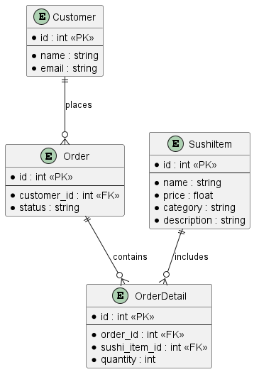
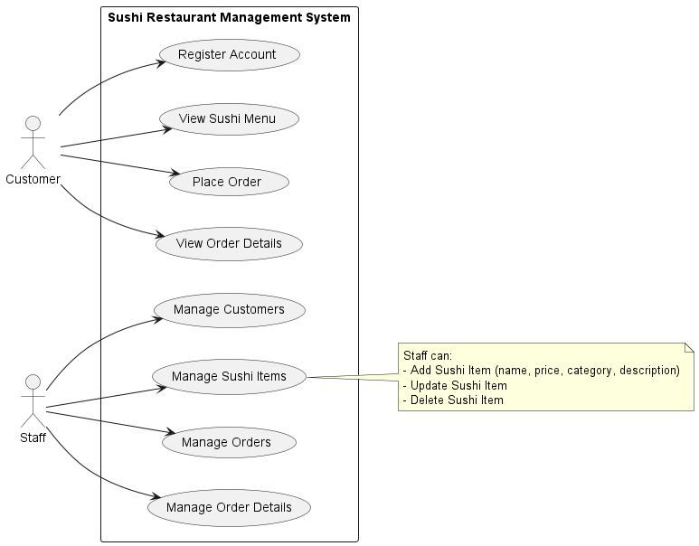

# 🍣 Sushi Restaurant Management API

A backend application for managing a sushi restaurant, built with **Flask**, **SQLAlchemy**, **Flasgger (Swagger UI)**, and **Docker**.  
It supports CRUD operations for Customers, Sushi Items, Orders, and Order Details.

---

## 📑 Table of Contents
1. [Introduction](#introduction)  
2. [Technologies](#technologies)  
3. [ERD + Use Case Diagram](#erd-use-case-diagram)
4. [Project Structure](#project-structure)
5. [Installation & Running](#installation-and-running)
6. [API Documentation & Swagger UI](#api-documentation-swaggerui)
7. [Unit Testing](#unit-testing)  
8. [Learning Objectives](#learning-objectives)  
9. [Future Improvements](#future-improvements)
10. [About the authour](#author)
11. [License](#license)
---

## 1. Introduction  

This project is a **Sushi Restaurant Management System** that provides REST APIs for:  
- Managing Customers  
- Managing Sushi Items  
- Managing Orders  
- Managing Order Details  

The project follows a **layered/clean architecture**:  
- `domain` → core entities  
- `application` → business logic / services  
- `infrastructure` → persistence (database models, repositories)  
- `presentation` → REST API routes  

It uses **Flask**, **SQLAlchemy**, and optionally **Docker**. API documentation is provided with **Swagger UI (Flasgger)**.

For details, see [docs/architecture.md](docs/architecture.md).

---

## 2. Technologies  

- Python (>=3.9)  
- Flask, Flask-Migrate, SQLAlchemy  
- SQL Server (via pyodbc) or SQLite  
- Docker (optional)  
- Swagger UI (Flasgger)  

---

## 3. ERD + Use Case Diagram

### Entity Relationship Diagram (ERD)



### Use Case Diagram



---

## 4. Project Structure  

```markdown
sushi-restaurant-management/
│── wsgi.py
│── requirements.txt / pyproject.toml
│── app/
│ ├── init.py
│ ├── config.py
│ ├── extensions.py
│ ├── domain/
│ │ ├── customer.py
│ │ ├── sushi_item.py
│ │ ├── order.py
│ │ └── order_detail.py
│ ├── application/
│ │ ├── customer_service.py
│ │ ├── sushi_item_service.py
│ │ ├── order_service.py
│ │ └── order_detail_service.py
│ ├── infrastructure/
│ │ ├── models/
│ │ └── repositories/
│ └── presentation/
│ ├── customer_route.py
│ ├── sushi_item_route.py
│ ├── order_route.py
│ └── order_detail_route.py
│── migrations/ (if using Flask-Migrate)
│── tests/
│ ├── conftest.py
│ ├── test_customer.py
│ ├── test_sushi_item.py
│ ├── test_order.py
│ └── test_order_detail.py
```

---

## 5. Installation & Running (Local)

### 5.1. Setup environment
```bash
git clone https://github.com/takahashidan85/sushi-restaurant-management.git
cd sushi-restaurant-management
```

#### (Recommended) create virtual environment
```bash
python -m venv .venv
```

#### Activate virtual environment

CMD:
```cmd
.venv\Scripts\activate
```
PowerShell:
```powershell
.venv\Scripts\Activate.ps1
```
If you got error, run PowerShell as Administrator and execute:
```powershell
Set-ExecutionPolicy -ExecutionPolicy RemoteSigned -Scope CurrentUser
```
Press **Y** to process

Linux/macOS:
```bash
source .venv/bin/activate
```


### 5.2. Install dependencies

```bash
pip install --upgrade pip
pip install -r requirements.txt
```

### 5.3. Database Migration

This project uses Flask-Migrate.
The `migrations/` folder is already included in the repo. You only need to run:
```bash
flask db upgrade
```

If you later modify models:
```bash
flask db migrate -m "describe your change"
flask db upgrade
```

### 5.4. Run the app

```bash
export FLASK_APP=wsgi.py
export FLASK_ENV=development
```

```bash
flask run --host=0.0.0.0 --port=8000
```

Or run with Gunicorn:
```
pip install gunicorn
gunicorn --bind 0.0.0.0:8000 wsgi:app
```

### 5.5. Run with Docker (optional)

```bash
docker build -t sushi-app .
docker run -p 8000:8000 sushi-app
```
---

## 6. API Documentation & Swagger UI

If Swagger (Flasgger) is enabled, access API docs at:
```bash
http://localhost:8000/apidocs
```

Or OpenAPI JSON at:
```bash
http://localhost:8000/apispec_1.json
```

Main Endpoints:

`/customers` → CRUD for customers
`/sushi_items` → CRUD for sushi items
`/orders` → CRUD for orders
`/order_details` → CRUD for order details

---

## 7. Unit Testing

Unit tests are written with pytest. The tests use an in-memory SQLite database so they are safe and isolated.

Run tests with:
```bash
pytest -v
```

Tests cover CRUD functionality for:
- Customers
- Sushi Items
- Orders
- Order Details

---

## 8. Learning Objectives

- Apply layered / clean architecture in software development.
- Implement RESTful CRUD APIs with Flask.
- Generate API documentation with Swagger.
- Manage database schema with Flask-Migrate.
- Write unit tests with pytest.
- Deploy application using Docker.

---

## 9. Future Improvements

- Add authentication (JWT).
- Build frontend (Web/Mobile).
- Deploy to cloud (Heroku, DigitalOcean, etc.).
- Add logging, CI/CD workflows.

---

## 10. About the author

- **Name:** Trần Cát Đằng (Takahashi Dan)
- **Email:** catdangtran1@gmail.com
- **Discord:** TakahashiDan
- **Github:** https://github.com/takahashidan85

---

## 11. License

- MIT License
