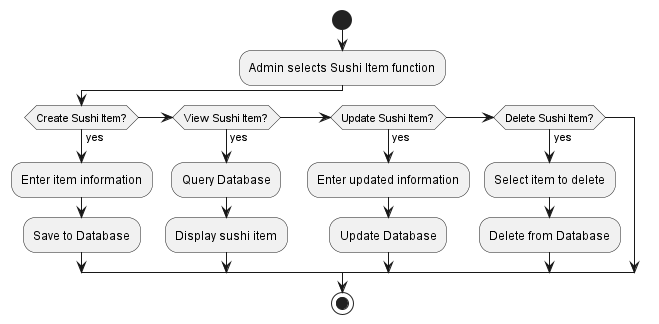

# Sushi Restaurant Management API

A backend application for managing a sushi restaurant, built with **Flask**, **SQLAlchemy**, **Flasgger (Swagger UI)**, and **Docker**.  
It supports CRUD operations for Customers, Sushi Items, Orders, and Order Details.

---

## Table of Contents
1. [Introduction](#1-introduction)  
2. [Technologies](#2-technologies)  
3. [System Diagrams](#3-system-diagrams)  
4. [Project Structure](#4-project-structure)  
5. [Installation & Running](#5-installation--running)  
6. [API Documentation & Swagger UI](#6-api-documentation--swagger-ui)  
7. [Unit Testing](#7-unit-testing)  
8. [Learning Objectives](#8-learning-objectives)  
9. [Future Improvements](#9-future-improvements)  
10. [About the Author](#10-about-the-author)  
11. [License](#11-license)

---

## 1. Introduction  

This project is a **Sushi Restaurant Management System** that provides REST APIs for:  
- Managing Customers  
- Managing Sushi Items  
- Managing Orders  
- Managing Order Details  

The project follows a **layered/clean architecture**:  
- `domain` → core entities & domain rules  
- `application` → business logic / services  
- `infrastructure` → persistence (database models, repositories)  
- `presentation` → REST API routes  

It uses **Flask**, **SQLAlchemy**, and optionally **Docker**. API documentation is provided with **Swagger UI (Flasgger)**.

For details, see [docs/architecture.md](docs/architecture.md).

---

## 2. Technologies  

- Python (>=3.9)  
- Flask, Flask-Migrate, SQLAlchemy  
- SQL Server (via pyodbc) or SQLite  
- Docker (optional)  
- Swagger UI (Flasgger)  

---

## 3. System Diagrams

### 3.1. Entity Relationship Diagram (ERD)


### 3.2. Use Case Diagram


### 3.3. Activity Diagrams

- Manage Sushi Item

    

- Manage Order workflow

    

### 3.4. Sequence Diagrams

- Customer create an account

    

- Employee change order status

    

For full diagrams, see [docs/diagrams.md](docs/diagrams.md)

---

## 4. Project Structure  

```markdown
sushi-restaurant-management/
├── app/ # Main application code
│ ├── core/ # Core config, logging, error handling
│ ├── modules/ # Domain modules
│ │ ├── customer/ # Customer API + business logic
│ │ ├── order/ # Order API + business logic
│ │ ├── order_detail/ # Order detail API
│ │ └── sushi_item/ # Sushi item API
│ ├── application/ # Service layer (use cases)
│ ├── domain/ # Entities, exceptions
│ ├── infrastructure/ # Database models & repositories
│ └── presentation/ # Controllers, schemas (Flask + Pydantic)
│
├── docs/ # Documentation (architecture, api_doc, diagrams)
├── migrations/ # Alembic migrations
├── tests/ # Unit tests (pytest)
├── instance/ # Local DB (sqlite)
│
├── swagger.json # OpenAPI spec
├── wsgi.py # App entrypoint
├── Dockerfile # Docker build
├── docker-compose.yml # Container orchestration
├── requirements.txt # Dependencies
├── pyproject.toml # Project metadata
```

---

## 5. Installation & Running

### 5.1. Setup environment
```bash
git clone https://github.com/takahashidan85/sushi-restaurant-management.git
cd sushi-restaurant-management
```

#### Create virtual environment
```bash
python -m venv .venv
```

#### Activate virtual environment

CMD:
```cmd
.venv\Scripts\activate
```
PowerShell:
```powershell
.venv\Scripts\Activate.ps1
```
If you got error, run PowerShell as Administrator and execute:
```powershell
Set-ExecutionPolicy -ExecutionPolicy RemoteSigned -Scope CurrentUser
```

Linux/macOS:
```bash
source .venv/bin/activate
```

### 5.2. Install dependencies

```bash
pip install --upgrade pip
pip install -r requirements.txt
```

### 5.3. Environment Variables

Copy the example file:

```bash
cp .env.example .env
```
Then edit .env if needed (database, secret key, etc.).

### 5.4. Database Migration

```bash
flask db upgrade
```

If you later modify models:
```bash
flask db migrate -m "describe your change"
flask db upgrade
```

### 5.5. Run the app

```bash
flask run --host=0.0.0.0 --port=8000
```

Or run with Gunicorn:
```bash
pip install gunicorn
gunicorn --bind 0.0.0.0:8000 wsgi:app
```

### 5.6. Run with Docker (optional)
Using docker-compose (recommended):
```bash
cp .env.example .env
docker-compose up --build
```
Or build manually:
```bash
docker build -t sushi-app .
docker run -p 5000:5000 --env-file .env sushi-app
```


---

## 6. API Documentation & Swagger UI

Swagger (Flasgger) provides auto-generated docs.

- Swagger UI: [http://localhost:8000/apidocs](http://localhost:8000/apidocs)  
- OpenAPI JSON: [http://localhost:8000/apispec_1.json](http://localhost:8000/apispec_1.json)  

### Example Endpoints

**Create Customer**
```http
POST /customers
Content-Type: application/json

{
  "name": "Alice",
  "email": "alice@example.com"
}
```
Response `201 Created`:
```json
{
  "id": 1,
  "name": "Alice",
  "email": "alice@example.com"
}
```

**Get All Customers**
```http
GET /customers
```
Response `200 OK`:
```json
[
  {"id": 1, "name": "Alice", "email": "alice@example.com"}
]
```

---

## 7. Unit Testing

*(placeholder)*

---

## 8. Learning Objectives

- Apply layered / clean architecture.  
- Implement RESTful CRUD APIs with Flask.  
- Generate API documentation with Swagger.  
- Manage database schema with Flask-Migrate.  
- Write unit tests with pytest.  
- Deploy application using Docker.  

---

## 9. Future Improvements

- Add authentication (JWT).  
- Add request validation (Marshmallow or Pydantic).  
- Build frontend (Web/Mobile).  
- Deploy to cloud (Heroku, DigitalOcean, etc.).  
- Add structured logging.  
- Add CI/CD with GitHub Actions.  

---

## 10. About the author

- **Name:** Trần Cát Đằng (Takahashi Dan)  
- **Email:** catdangtran1@gmail.com  
- **Discord:** TakahashiDan  
- **Github:** https://github.com/takahashidan85  

---

## 11. License

- MIT License
